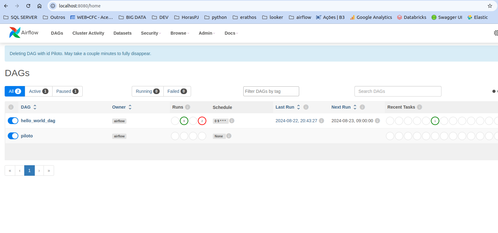

# Apache Airflow com Docker

Este projeto configura o Apache Airflow usando Docker e Docker Compose. Ele inclui uma DAG simples para avaliação da empresa superfrete. Siga os passos abaixo para iniciar o Airflow em seu ambiente local.

## Passo a Passo

### 1. Crie os diretórios necessários

Primeiro, vamos criar os diretórios que serão usados pelo Airflow para armazenar as DAGs, logs, plugins e arquivos de configuração:

```bash
mkdir -p ./dags ./logs ./plugins ./config
```

### 2. exporte o valor do AIRFLOW_UID
Em seguida precisamos armazenar o valor do user do airflow para o .env 
```bash
echo -e "AIRFLOW_UID=$(id -u)" > .env 
``` 

### 3 Inicialize o banco de dados
Agora é necessário iniciar o banco de dados do airflow. Você precisa iniciar um database e criar a primeira conta de usuário( Isso apenas para esse exercício, não é comum subir um bd na criação do Airflow, geralmente usamos uma instancia fora do docker para manter a persistencia dos dados em casos de rebuild da imagem). Para isso, execute:
```bash
docker compose up airflow-init
```

### 4. Por último, inicie o Airflow
```bash
docker compose up
``` 

Se tudo ocorrer com sucesso, acesse [airflow](http://localhost:8080/) e você verá uma tela semelhante a essa:
